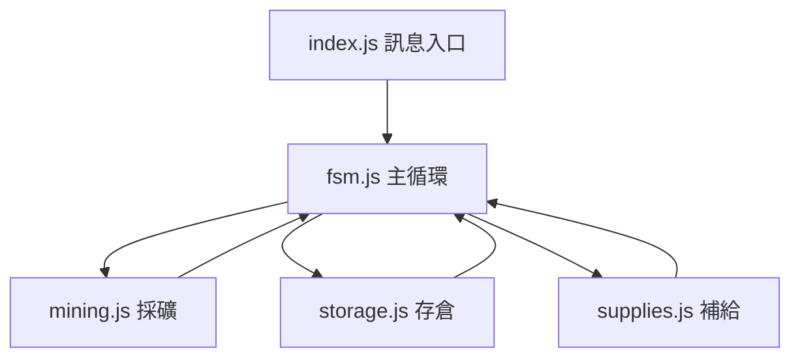
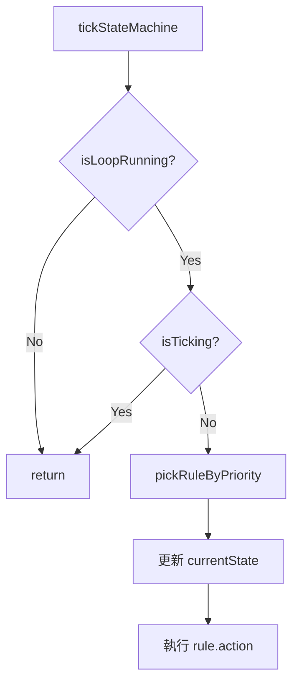

# Minecraft Bot 架構與維護指南

這份文件的目的不是只解釋 FSM，而是讓你在幾個月後回來看時，仍能快速回答三個問題：

1. 這個 bot 的主流程怎麼跑
2. 各模組責任邊界在哪裡
3. 要新增一個新行為或新模組時，應該接在哪一層

---

## 1. 專案總覽

目前專案是一個以 Mineflayer 為核心、由單一 FSM 調度的 Minecraft 工作機器人。

主要特性：
- 對外只有一個控制入口：私訊指令
- 對內只有一個主流程協調者：fsm.js
- 採礦、存倉、補給都屬於「被 FSM 呼叫的任務模組」
- 模組之間盡量不互相直接控制流程，而是透過 FSM 的 state 與 callback 協作

專案檔案分工：
- index.js：Bot 啟動、插件安裝、訊息監聽、對外指令入口
- fsm.js：狀態定義、規則優先序、主循環 tick、狀態切換、共享 state
- mining.js：採礦行為實作，屬於 Mine 狀態的底層工作模組
- storage.js：依告示牌找到倉儲箱並存物
- supplies.js：依告示牌找到補給箱並補齊裝備與食物
- config.js：帳號、主人的 ID、伺服器與固定指令配置
- fsm.test.js：FSM 與 mining 關鍵行為的單元測試
- FSM_MAINTENANCE.md：本文件

---

## 2. 啟動流程

整體執行順序如下：

1. index.js 建立 Mineflayer bot
2. index.js 載入 pathfinder 與 collectBlock 插件
3. bot spawn 後設定 pathfinder movements
4. index.js 監聽 messagestr
5. 主人私訊 go / storage / stop
6. index.js 呼叫 fsm.js 對外 API
7. fsm.js 開始每 500ms 做一次規則判斷與行為執行

可以把資料流想成：



重點：
- index.js 不直接決定採礦、補給、存倉的執行時機
- 真正的流程決定權集中在 fsm.js
- mining.js、storage.js、supplies.js 都是執行模組，不是流程總管

---

## 3. 架構分層

### 3.1 入口層：index.js

責任：
- 建立 bot
- 安裝插件
- 監聽 spawn、messagestr、error、kicked
- 解析主人私訊
- 呼叫 FSM API

不該做的事：
- 不該在這裡直接寫採礦流程
- 不該在這裡直接呼叫 storage.js 或 supplies.js 組流程
- 不該自己管理優先序

目前對外指令：
- go：啟動主循環
- storage：要求 FSM 進入手動存倉流程
- stop：停止主循環

### 3.2 協調層：fsm.js

責任：
- 定義狀態列舉 FSM_STATE
- 定義共享 state
- 定義 rules 與優先度
- 每個 tick 選擇要執行哪個 state
- 執行 runEscape、runSupply、runMine 等行為入口
- 把共享狀態轉成 runtime callback 傳給 mining.js

這是整個專案最重要的檔案，因為它決定：
- 何時補給
- 何時存倉
- 何時 RTP
- 何時採礦
- 多個任務衝突時誰先做

### 3.3 任務層：mining.js / storage.js / supplies.js

責任：
- 接收 FSM 交辦的工作
- 專注完成單一任務
- 必要時回報 FSM 需要的狀態資訊

任務層不應做的事：
- 不應自行決定全域優先序
- 不應自己管理主循環 timer
- 不應直接處理主人聊天命令

---

## 4. 目前狀態機設計

### 4.1 狀態列表

目前狀態：
- Idle
- Escape
- Eat
- ManualStorage
- Supply
- InventoryStorage
- EnsureWild
- Mine

### 4.2 規則優先序

由高到低：

1. Escape
2. Escape（採礦卡死 / 發呆過久）
3. Eat
4. ManualStorage
5. Supply
6. InventoryStorage
7. EnsureWild
8. Mine

這表示同一個 tick 只會執行一個狀態，避免互相搶控制權。

### 4.3 決策流程

tickStateMachine(bot) 的流程：

1. 檢查 loop 是否啟動
2. 檢查是否已有另一個 tick 在跑
3. 掃描排序好的 rules
4. 取第一個 condition 成立的 rule
5. 更新 currentState
6. 執行對應 action

可以想成：



---

## 5. 共享狀態 state 的用途

fsm.js 的 state 是整個專案的共享控制面。

主要欄位：
- isLoopRunning：主循環是否運行
- tickTimer：setInterval timer
- isTicking：避免同時重入 tick
- mcData：Minecraft 版本資料
- pendingStorage：是否有手動存倉請求
- isInWild：是否位於野外工作區
- collectErrorCount：連續採礦異常次數
- damageDetected：是否偵測受傷
- enemyDetected：保留中的敵人旗標
- healthListenerInstalled：血量監聽是否已安裝
- lastHealth：血量基準值
- currentState：目前狀態
- miningLastPosition：採礦卡點的基準位置
- miningIdleSince：開始發呆的時間點
- miningIdleWarningShown：是否已顯示發呆警告
- lastMiningTargetCount：上一輪採礦找到的方塊數

設計原則：
- state 只放跨 tick、跨模組仍有意義的資訊
- 單次函式內部的暫存變數不要塞進 state
- FSM 自己擁有 state，其他模組盡量透過 callback 操作，不要直接碰 global state

---

## 6. 模組之間的程式碼流向

### 6.1 go 指令

流程：

1. 主人私訊 go
2. index.js 呼叫 fsm.startLoop(bot)
3. fsm.js 初始化 state
4. fsm.js 啟動 setInterval
5. 第一輪立即執行 tickStateMachine(bot)
6. 根據規則進入 Supply / EnsureWild / Mine 等狀態

### 6.2 storage 指令

流程：

1. 主人私訊 storage
2. index.js 呼叫 fsm.requestStorage()
3. fsm.js 將 pendingStorage 設為 true
4. 下一輪 tick 命中 ManualStorage 規則
5. runManualStorage(bot) 執行：
   - 回基地
   - 呼叫 storage.storeAllItemsToSignChest()
   - 呼叫 supplies.checkAndSupply()
   - 完成後回到 FSM 的正常流程

### 6.3 採礦流程

流程：

1. FSM 選到 Mine
2. runMine(bot) 呼叫 mining.runMineStep(bot, runtime)
3. mining.js 搜尋附近泥土目標
4. 透過 pathfinder 靠近方塊
5. dig 成功後透過 callback 回報 markMiningProgress
6. FSM 在後續 tick 依 state 決定是否繼續採礦或轉換狀態

### 6.4 採礦卡住 / 無目標時的流向

目前設計不是讓 mining.js 直接執行 /rtp，而是：

1. mining.js 每輪先把 targets.length 回報給 FSM
2. fsm.js 在 shouldRtpForMiningStuck() 讀取：
   - 是否長時間沒移動
   - 是否 lastMiningTargetCount === 0
3. 若條件成立，FSM 選擇 Escape
4. runEscape(bot) 統一做清理與 /rtp

這種設計的好處：
- 所有 RTP 邏輯集中在 FSM
- 任務模組不需要各自維護逃生流程
- 之後若要新增「因為其他理由 RTP」時，可直接接在規則層

---

## 7. mining.js 的設計重點

mining.js 是目前最像「可重用子系統」的模組。

它的工作拆成三層：

1. 搜尋目標
- collectNearbyDirtTargets()

2. 單目標執行
- mineSingleTarget()

3. 單步採礦流程
- runMineStep()

目前 runMineStep 採用 strict runtime contract：
- FSM 必須提供 state callbacks
- mining.js 不再假設可以隨便直接改全域 state

FSM 傳入的 runtime.state callback 目前包含：
- markMiningProgress
- setIsInWild
- resetCollectErrorCount
- incrementCollectErrorCount
- setTargetCount

這代表 mining.js 與 fsm.js 之間的介面已經比以前清楚：
- mining.js 負責回報「發生了什麼」
- fsm.js 負責決定「全域狀態要怎麼變」

---

## 8. storage.js 與 supplies.js 的共通模式

這兩個模組雖然做的事不同，但都遵守相同模式：

1. 先找告示牌
2. 根據告示牌文字篩選出正確目標
3. 從告示牌六個相鄰方塊尋找箱子
4. 用多個候選站位嘗試靠近箱子
5. 導航失敗時，退化成直接嘗試開箱

這個模式的原因：
- 單點 pathfinder 對箱子常有不穩定情況
- 多站位重試比直接貼箱子更穩
- 開箱 fallback 可以降低 pathfinder 偶發中斷造成的整體失敗率

如果之後有新模組也要依告示牌找箱子，優先沿用這個模式，不要另寫一套不同導航策略。

---

## 9. 未來新增新模組的教學

這裡分成兩種情況：

### 9.1 新增的是「任務模組」

例如：
- woodcutting.js 砍樹
- farming.js 種田收成
- smelting.js 冶煉

這類模組的標準做法：

1. 建立新檔案
- 專注在單一任務
- 不要在裡面監聽聊天命令
- 不要在裡面建立 setInterval 主循環

2. 設計模組 API
- 盡量維持像 `runXxxStep(bot, runtime)` 或 `performXxx(bot, options)` 的形式
- 若需要改全域狀態，透過 callback 傳入，不要直接 `require('./fsm')` 然後改 state

3. 把需要的共享狀態抽成 callback
- 例如：
  - setIsInWild
  - setNeedsRepair
  - recordHarvestProgress

4. 回到 fsm.js 接線
- 增加新的狀態
- 增加新的 rule
- 增加新的 runXxx
- 把 runtime callback 組好傳給新模組

### 9.2 新增的是「FSM 狀態」

以新增 Repair 為例，建議流程如下：

1. 在 FSM_STATE 新增 Repair
2. 新增條件函式，例如 needRepair(bot)
3. 在 rules 中決定優先序
4. 新增 runRepair(bot)
5. 若有新模組 repair.js，從 runRepair 呼叫它
6. 思考與現有狀態的衝突：
   - Repair 是否比 Supply 重要
   - Repair 是否可被 Escape 打斷
   - Repair 完成後應該回到野外還是基地

---

## 10. 新增模組的實作模板

以下是一個推薦模板：

```js
// woodcutting.js
const WOODCUTTING_CONFIG = {
	searchDistance: 16,
	maxTargets: 10
};

function requireWoodcuttingRuntimeState(runtime) {
	if (!runtime || !runtime.state) {
		throw new Error('runWoodcuttingStep requires runtime.state callbacks.');
	}

	const requiredCallbacks = [
		'markWoodcuttingProgress',
		'setIsInWild'
	];

	for (const callbackName of requiredCallbacks) {
		if (typeof runtime.state[callbackName] !== 'function') {
			throw new Error(`runWoodcuttingStep requires runtime.state.${callbackName}() callback.`);
		}
	}

	return runtime.state;
}

async function runWoodcuttingStep(bot, runtime) {
	const runtimeState = requireWoodcuttingRuntimeState(runtime);
	const cfg = runtime.loopConfig || WOODCUTTING_CONFIG;

	// 搜尋目標
	// 執行工作
	// 成功時回報 runtimeState.markWoodcuttingProgress()
	// 需要離開區域時 runtimeState.setIsInWild(false)
}

module.exports = {
	WOODCUTTING_CONFIG,
	runWoodcuttingStep
};
```

FSM 端接法：

```js
async function runWoodcutting(bot) {
	await woodcutting.runWoodcuttingStep(bot, {
		loopConfig: woodcutting.WOODCUTTING_CONFIG,
		state: {
			markWoodcuttingProgress: () => {
				// 更新 FSM state
			},
			setIsInWild: (isInWild) => {
				state.isInWild = isInWild;
			}
		}
	});
}
```

---

## 11. 維護規則

### Do

- 讓 FSM 保有唯一流程控制權
- 讓任務模組只做任務，不做總控
- 把共用配置集中在模組內 config 或 fsm.js 的 LOOP_CONFIG
- 在模組邊界使用明確 callback / return status
- 新增狀態前，先決定它與現有規則的優先序

### Don't

- 不要在 index.js 直接拼湊採礦、補給、存倉流程
- 不要在任務模組內直接啟動另一個主循環
- 不要讓多個模組各自定義 RTP 優先序
- 不要把全域 state 直接散佈到多個模組任意修改
- 不要為了小功能新增第二套狀態系統

---

## 12. 常見修改情境

### 情境 A：調整採礦卡點判定

應該先看：
- fsm.js 的 shouldRtpForMiningStuck()
- mining.js 的 setTargetCount 回報

不應只改 mining.js，因為真正的 RTP 決策在 FSM。

### 情境 B：調整補給邏輯

應該先看：
- fsm.js 的 needSupplies()
- supplies.js 的 checkAndSupply()

前者決定何時補給，後者決定怎麼補給。

### 情境 C：新增主人命令

應該先看：
- index.js 的 messagestr handler
- fsm.js 是否需要新增 requestXxx() 或新狀態

命令只負責「下達意圖」，真正執行交給 FSM。

---

## 13. 驗證與測試建議

每次修改後至少做：

1. 語法檢查
- node -c index.js
- node -c fsm.js
- node -c mining.js
- node -c storage.js
- node -c supplies.js

2. 問題面板確認無新增錯誤

3. 重要流程手測
- go
- storage
- stop
- 缺工具時補給
- 背包滿時存倉
- 區塊無泥土時是否正確 RTP

4. 若環境已安裝依賴，再跑 fsm.test.js

---

## 14. 何時該重構

出現以下任一情況時，就該考慮拆層：

- fsm.js 的 rules 或 runXxx 變得過長
- 多個模組開始共用大量 callback 契約
- 新增一個狀態要同時改 4 個以上舊狀態
- 採礦、補給、存倉開始需要更細的子狀態

可考慮的方向：
- 拆出 fsm/decision.js：純規則與判斷
- 拆出 fsm/actions.js：runEscape、runMine、runSupply 等行為入口
- 拆出 fsm/runtimeBuilders.js：各任務模組的 callback 契約組裝
- 把告示牌找箱子邏輯抽成 shared chest navigation util

---

## 15. 一句話總結

這個專案的核心原則是：

> index.js 負責接命令，fsm.js 負責做決策，mining/storage/supplies 負責完成任務。

只要維持這個邊界，之後要加新模組、新狀態、新任務，成本都會低很多。
